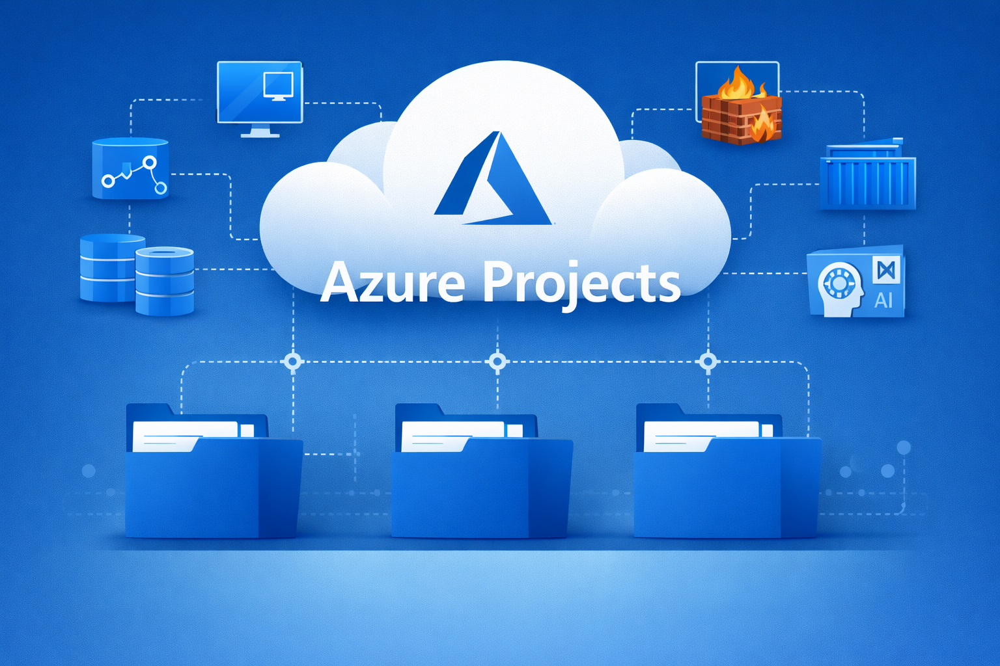

# 🌐 Azure Projects Repository

 
*Professional Azure projects collection for hands-on learning, demos, and real-world implementations.*

---

## 🔹 Overview

This repository is a curated collection of **Microsoft Azure projects**, covering a wide range of services such as **Virtual Machines, Networking, Firewalls, Storage, Containers, AI, and more**.
The main goal of this repository is to provide **hands-on practical projects** to help learners, developers, and cloud enthusiasts understand and implement Azure services in real-world scenarios.
Each project is organized in its **own folder**, with step-by-step instructions, code snippets, and diagrams wherever necessary.

---

## 📂 Project List

Below is the list of projects included in this repository. New projects will be added sequentially with numbering:

1. **[Azure Networking & Firewall Demo](./AzureNetworking-Firewall-Demo)**  
   - **Description:** Demonstrates a Linux VM without a public IP connected via Azure Bastion, protected by Azure Firewall, with DNAT to access Nginx from the internet.  
   - **Key Services:** Virtual Machine, Azure Bastion, Azure Firewall, Nginx, DNAT.  
   - **Folder:** `AzureNetworking-Firewall-Demo`


---

## 🔹 How to Use

1. Clone the repository:

```bash
    git clone https://github.com/<YourUsername>/azure-projects.git
    Navigate to the project folder you want to try:
    cd AzureNetworking-Firewall-Demo
    Follow the instructions inside each project folder to deploy or run the project on Azure.


